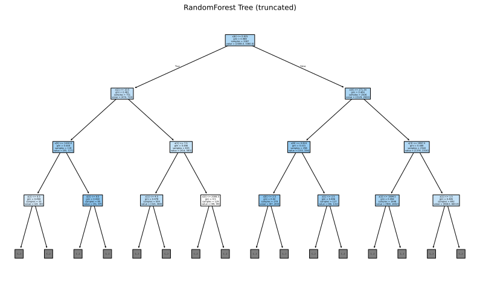
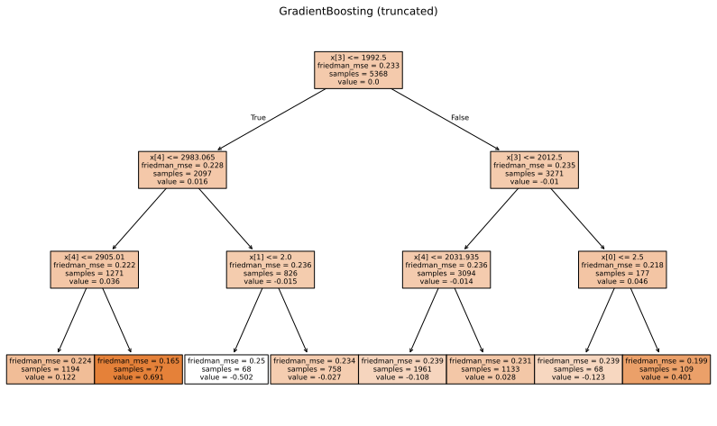

# A sales opportunities ranking for CRM

## PROJECT OVERVIEW

This is a model that evaluates client-provided product descriptions to generate positivity scores reflecting customer sentiment. By integrating these sentiment insights with key client characteristics, the model identifies and prioritizes the most promising sales opportunities - delivering to each salesperson a tailored list of their top three prospects for focused action

## DATA
The project is using data from two sources - both available via Kaggle platform that are then merged to create a synthetic data used to train model. 
The details of the each data sources is provided under 

[View the Data Sheet](./data_sheet.md)

The synthetic data set is then enhanced further using sentiment analysis.

## MODEL 

We are using ensemble model that has few inputs: sentiment model to for pre-processing and than an ensemble of GradientBoost and RandomForest which are used as base learners.

Here is the resulting classification tree for the Random Forest:

Here is the resulting classification tree for the Gradient Boost Forest:

A full model card is provided as a part of the project: [View the Model Card](./model_card.md)

## HYPERPARAMETER OPTIMSATION

Given fairly small data set for the training no hyperparameter optimisation was not done.

## RESULTS

The model demonstrates consistent predictive accuracy, correctly identifying over 60% of opportunities. Preliminary observations suggest this outperforms human sales representatives’ forecasts, though additional A/B testing is required to validate the finding.

